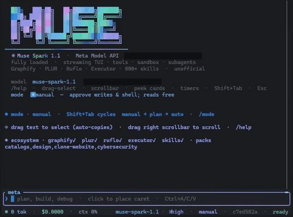

# Meta CLI (unofficial)

<p align="center">
  
</p>

**Fully loaded terminal coding agent** for [Meta Model API](https://dev.meta.ai/) — not a thin wrapper. Custom Rust harness, dense Meta-blue TUI, **native vision**, tools, knowledge stack, hardened sandbox. Any model id via `--model` / `/model` / config.

> Not affiliated with Meta Platforms, Inc. · Community · [nuroctane/meta-cli](https://github.com/nuroctane/meta-cli)

```text
meta          # primary — Meta-blue interactive TUI
muse          # legacy alias (same binary)
```

**v0.7.0** — Production-minded agent harness, end to end: **[Docs](https://nuroctane.github.io/meta-cli/)**

| Surface | What ships |
|---------|------------|
| **TUI** | Streaming · duration chips · expandable thought/tool cards · click-to-peek · **drag-select** · always-on scrollbar · ↓ End · sticky prompt · sessions browser · approval mini-diff |
| **Agent** | Manual / plan / auto · tool loop · subagents · todos · auto-compact · Esc cancel · Shift+Tab mid-turn · prompt-cache keys |
| **Vision** | **`look`** (images / short video) · **`extract_frames`** (ffmpeg keyframes) · prompt auto-attach of media paths |
| **Tools** | read · edit · bash · web · git · knowledge stack · agent |
| **Ecosystem** | Graphify · PLUR · Ruflo · Executor · **omp** · AKM · **800+ skills** — background provision |
| **Hardening** | Sandbox · bash denylist · SSRF blocks · atomic `~/.meta` IO · API retries · install SHA-256 · `meta doctor` |
| **Host panels** | Live `status.json` / `usage.jsonl` · Orca hook when present |

---

## Why Meta CLI

| | |
|--|--|
| **Real agent, not a wrapper** | Custom Rust harness: modes, tools, sandbox, streaming, cancel, subagents, auto-compact |
| **Sees media** | Muse multimodal via Responses `input_image` / `input_video` — sparse frames, not frame-by-frame spam |
| **One-shot install** | Build · PATH · ecosystem · Orca hook · optional auth |
| **Opens instantly** | Ecosystem repair in the **background**; TUI never blocks on npm/uv |
| **Knowledge stack** | Code graph · shared engrams · vector memory · MCP gateway · skill packs |
| **Simple input** | Drag-select · scrollbar · **Ctrl+A / C / V / X** — no mouse “mode” toggle |
| **Secrets stay local** | API key only in `~/.meta/auth.json` |

---

## Feature map

### Agent harness
- Meta Model API **Responses** streaming + reasoning effort (`minimal` → `xhigh`)
- **Manual / plan / auto** permission modes — **Shift+Tab** applies mid-turn
- Tool loop with parallel-safe tools, approval gates, Esc cancel
- **Subagents**, todos, plan mode (`submit_plan`), auto-compact under context pressure
- Project instructions: `META.md` · `AGENTS.md` · `CLAUDE.md` (legacy `MUSE.md` still loaded)
- Session resume (`-c`, `-r`, `/sessions`) with prompt-first picker
- **Prompt cache key** per session (helps surface `cached_tokens`)

### Tools (native)

| Family | Tools |
|--------|--------|
| read | `read_file` `list_dir` `grep` `glob` |
| edit | `write_file` `edit_file` `multi_edit` `apply_patch` |
| shell | `bash` (hardened denylist + timeout) |
| **vision** | **`look`** · **`extract_frames`** |
| web | `web_search` `web_fetch` (text only; SSRF / private-IP blocks) |
| git | `git_status` `git_diff` |
| knowledge | `graphify` `plur` `ruflo` `executor` `skill` `memory` |
| delegate | `agent` `omp` — omp.sh coding-agent backend (LSP renames, DAP debugging, AST rewrites) |
| agent | `todo_write` `submit_plan` `agent` |

### Vision (design / multimodal)

Muse Spark accepts multimodal input on the Responses API. Meta CLI wires that in:

| Tool | What it does |
|------|----------------|
| **`look`** | Attach workspace **image(s)** (png/jpg/webp/gif) or a **short video** (mp4/webm/mov, ~20MB cap) so the model *sees* them on the next turn |
| **`extract_frames`** | Sparse **keyframes** via **ffmpeg** (default ~1 fps, max ~8) → `.meta/frames/<name>/` and auto-queues `look` |

**Efficient design-from-video (e.g. 10s reference clip):**

```text
meta "steal UI design tokens from demo.mp4 and scaffold a matching component"
```

Or: `extract_frames` → model inspects stills → implement with **design-eng** skills.

- Paths like `demo.mp4` / `shot.png` in the user prompt **auto-attach** when the file exists in the workspace  
- Prefer sparse frames over frame-by-frame every pixel  
- Longer / huge videos: extract frames first; don’t `look` a giant file  

### Ecosystem (auto-provisioned)

| Piece | Role |
|-------|------|
| **Graphify** | Code knowledge graph (`graphify-out/`) — query / path / explain |
| **PLUR** | Shared engram memory across tools/sessions |
| **Ruflo** | Vector memory + swarm/hive patterns |
| **Executor** | MCP / OpenAPI gateway catalog |
| **Skills** | Progressive packs (design-eng, clone-website, cybersecurity, …) via `skill` |
| **AKM** | Agent knowledge package manager (when Node available) |

### TUI (Meta-blue)
- Streaming assistant · violet **thought** cards · colour-coded **tool** cards  
- **Duration chips** · cards collapsed by default · click-to-peek · **↓ End**  
- **Drag text to select** (auto-copy) · **drag scrollbar** always on  
- **Ctrl+A** select-all · **Ctrl+C** copy · **Ctrl+V** paste · **Ctrl+X** cut  
- Sticky PROMPT banner · sessions modal · approval **mini-diff**  
- Splash shows the **active model title** only there; rest of chrome is model-agnostic  

### Reliability & safety
- Atomic writes under **`~/.meta/`** (auth, sessions, status, history)  
- API **retries** · process timeouts · config validation · `meta doctor`  
- Install scripts verify **SHA-256** of the binary  
- Gap-fill migrate from legacy `~/.muse/` (never overwrites existing `.meta` files)  

---

## Install (one shot)

### Windows (PowerShell)

```powershell
irm https://raw.githubusercontent.com/nuroctane/meta-cli/main/install.ps1 | iex
```

### macOS / Linux

```bash
curl -fsSL https://raw.githubusercontent.com/nuroctane/meta-cli/main/install.sh | bash
```

That command will:

1. Install Rust if needed  
2. Clone or update this repo  
3. `cargo build --release`  
4. Install **`meta`** (+ `muse` alias) to `~/.local/bin` and **verify SHA-256**  
5. `meta ecosystem ensure` when Node/uv are available  
6. Orca hook when possible  
7. Save auth if `META_API_KEY` / `MODEL_API_KEY` is set (**machine-local only**)  

```powershell
meta auth login    # → ~/.meta/auth.json only
meta               # open the TUI
meta doctor        # health check (incl. ffmpeg / vision)
```

Or sign in **from inside the TUI**: run `meta` and use `/login` (secure masked key
entry — never echoed to the transcript or history) and `/logout` (clears the stored
key). Launching with no key opens the login prompt automatically.

Key: [dev.meta.ai](https://dev.meta.ai/) → API keys.

### Already cloned

```powershell
cd meta-cli
.\install.ps1          # Windows
# ./install.sh         # macOS / Linux
```

### Prerequisites (optional but recommended)

| Need | For |
|------|-----|
| **Node.js 20+** | PLUR, Ruflo, Executor, skills CLI, AKM |
| **uv** (or Python 3.10+) | Graphify |
| **ripgrep** | Fast `grep` / `glob` (falls back if missing) |
| **ffmpeg** | `extract_frames` / design-from-video (optional; `look` still works on short videos & images) |

---

## Secrets (important)

| On GitHub | On your PC only |
|-----------|-----------------|
| Source, README, install scripts | `~/.meta/auth.json` (API key) |
| No keys, no `.env`, no sessions | `~/.meta/sessions/`, usage logs, frames under workspace `.meta/frames/` |

See [SECURITY.md](./SECURITY.md). **Never commit your Meta API key.**

Upgrading from older builds: gap-fill copy from `~/.muse/` → `~/.meta/` for any missing files (auth, sessions, ruflo, skills, …). `meta auth logout` clears **both** homes.

---

## Quick use

```text
meta                         # interactive Meta-blue TUI
meta "fix the bug"          # start with a prompt
meta "design from ref.mp4"   # vision: auto-attach media if path exists
meta -c                      # continue last session in this directory
meta -r <session-id>         # resume a session
meta --mode plan "…"         # plan mode (explore + shell freely; no edits/commits)
meta run "…" -y              # headless + auto-approve
meta sessions
meta usage
meta auth status
meta ecosystem status
meta ecosystem ensure --force
meta doctor                  # auth · config · ecosystem · PATH · ffmpeg · sha256
```

Launching from a drive root (`C:\`) auto-picks a safe workspace (git / last session / Laboratory).

---

## Permission modes (live — Shift+Tab)

| Mode | Behavior |
|------|----------|
| **manual** | Reads free (`look`, reads, …); writes / shell / `extract_frames` need approval (`y` / `a` / `n`) |
| **plan** | Explore + analyze freely — reads, `look`, graphify/plur/ruflo queries, **and shell** for reading/parsing/tests/scratch + media compute (`ffmpeg`, `extract_frames`, copy a clip). Blocks only **code authoring** (`write_file`/`edit_file`/`multi_edit`/`apply_patch`) and **repo/VCS mutations** (git commit/push/add/reset/…, `gh pr create`, dependency installs) |
| **auto** | Auto-approve tools (`-y` / `--mode auto`) |

---

## TUI

### Keys

| Key | Action |
|-----|--------|
| `↑` `↓` · wheel · drag scrollbar | Scroll transcript |
| **Drag on chat text** | Select + auto-copy |
| **Click `↓ N · End`** | Jump to latest |
| Click card / `▸` | Peek / expand |
| `p` / `e` (empty input) | Peek latest / expand |
| **Ctrl+A** | Select-all input (or whole transcript if input empty) |
| **Ctrl+C** | Copy selection (transcript or input); else interrupt / double-tap quit |
| **Ctrl+V** | Paste into input |
| **Ctrl+X** | Cut input selection (or whole input) |
| `Shift+Tab` | Cycle permission mode |
| `Ctrl+R` | Sessions browser |
| `y` / `a` / `n` | Approve once / always / deny |
| `Esc` | Close peek, then cancel turn |

### Slash commands

| Command | Purpose |
|---------|---------|
| `/help` | Keys + commands |
| `/mode` `/plan` `/manual` `/auto` | Permission |
| `/todos` `/memory` `/skills` | Session state |
| `/graphify` `/plur` `/ruflo` `/ecosystem` | Knowledge stack |
| `/compact` `/usage` `/model` `/effort` | Context & model |
| `/sessions` `/resume` | Same sessions browser |
| `/init` `/config` `/clear` `/new` `/exit` | Project & shell |
| `/login` `/logout` | Authenticate / clear stored key |
| `/bug` | Open GitHub issues page |

### Quick memory

Type `#` followed by a note to save it directly to `~/.meta/memory.md` without starting a turn — persisted and recalled across sessions.

### Colour system

| Family | Hue | Tools |
|--------|-----|-------|
| read | sky | `read_file` `list_dir` `grep` `glob` |
| edit | violet | `write_file` `edit_file` `multi_edit` `apply_patch` |
| shell | amber | `bash` |
| vision | pink | `look` `extract_frames` |
| web | teal | `web_fetch` `web_search` |
| git | cyan | `git_status` `git_diff` |
| knowledge | indigo / orange | `graphify` `plur` `ruflo` `skill` `memory` … |

---

## ADE / Orca

| Path | Role |
|------|------|
| `~/.meta/status.json` | Live tokens · cost · model · state |
| `~/.meta/usage.jsonl` | Per-request log |
| `~/.meta/ade.json` | Discovery manifest |

```text
meta install-hook
orca terminal create --command meta
```

---

## Config

`~/.meta/config.toml` (created on first run):

```toml
model = "muse-spark-1.1"   # any Meta Model API model id
base_url = "https://api.meta.ai/v1"
reasoning_effort = "high"
max_turns = 40
stream = true
context_window = 1000000
```

Override home with `META_HOME` (legacy `MUSE_HOME` still honored). Env: `META_API_KEY` / `MODEL_API_KEY` / `META_MODEL`.

---

## Acknowledgements

The whole terminal UI — every card, border, animation, and the drag-select /
scrollbar plumbing — is built on **[Ratatui](https://ratatui.rs/)**
([github.com/ratatui/ratatui](https://github.com/ratatui/ratatui)), the
Rust TUI library, with **[crossterm](https://github.com/crossterm-rs/crossterm)**
underneath for input and rendering. Meta CLI's dense Meta-blue interface simply
wouldn't exist without the Ratatui folks — huge thanks to them. 💙

Assistant markdown in the transcript is parsed by joshka's
**[tui-markdown](https://github.com/joshka/tui-markdown)** — we re-tint its
output to the Meta-blue palette on top. Long peek dialogues scroll via
**[tui-scrollview](https://crates.io/crates/tui-scrollview)**, inline image
peeks render through **[ratatui-image](https://crates.io/crates/ratatui-image)**
(sixel / kitty / iTerm2, halfblocks fallback), and the smooth fractional
scrollbar is modelled on **[tui-scrollbar](https://crates.io/crates/tui-scrollbar)**'s
subcell math.

The `omp` tool delegates to **[Oh My Pi](https://omp.sh)**
([can1357/oh-my-pi](https://github.com/can1357/oh-my-pi)) — headless backend
runs only, provisioned automatically when Bun is available.

Also built on: [tokio](https://tokio.rs), [reqwest](https://github.com/seanmonstar/reqwest),
[serde](https://serde.rs), and [clap](https://github.com/clap-rs/clap).

---

## License

**GNU General Public License v3.0 (or later)** — see [LICENSE](./LICENSE).

Meta CLI is free software: you may redistribute it and/or modify it under the
terms of the GPL as published by the Free Software Foundation, either version 3
of the License, or (at your option) any later version. It is distributed in the
hope that it will be useful, but **without any warranty**; without even the
implied warranty of merchantability or fitness for a particular purpose.
